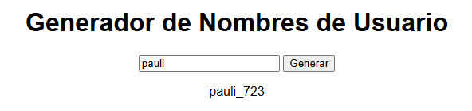

# proyecto-generador-usuarios
Proyecto DPL - Generador usuarios

## Descripción
Este proyecto consiste en una aplicación web sencilla que permite generar nombres de usuario de forma automática.  
El usuario introduce una palabra base y la aplicación combina dicha palabra con números aleatorios para crear un nombre de usuario único.

## Tecnologías utilizadas
- HTML
- CSS
- JavaScript

## Instalación y ejecución
1. Clonar el repositorio
2. Abrir el archivo src/index.html en el navegador

## Capturas

